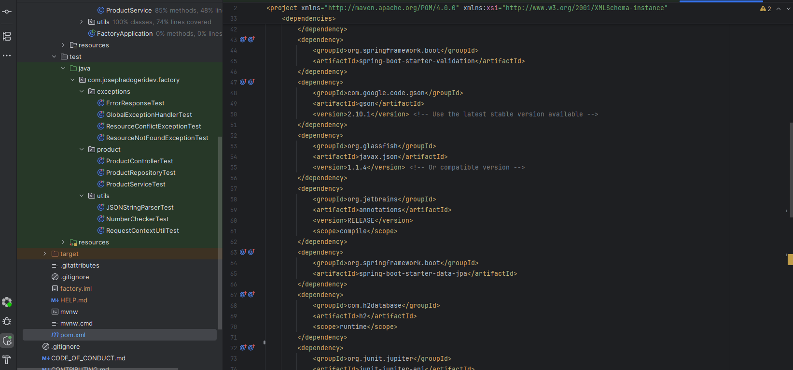
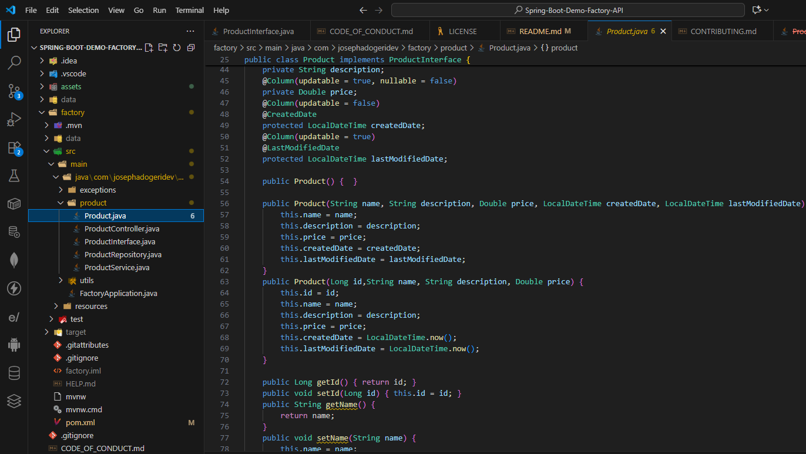
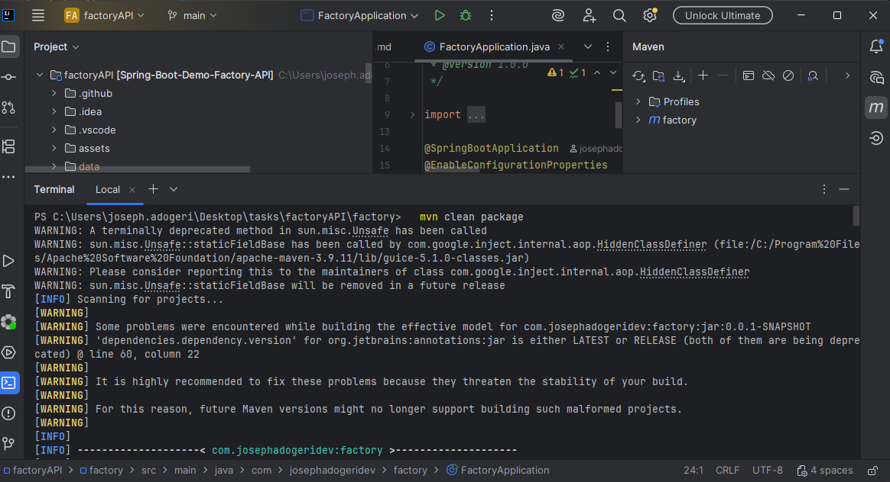
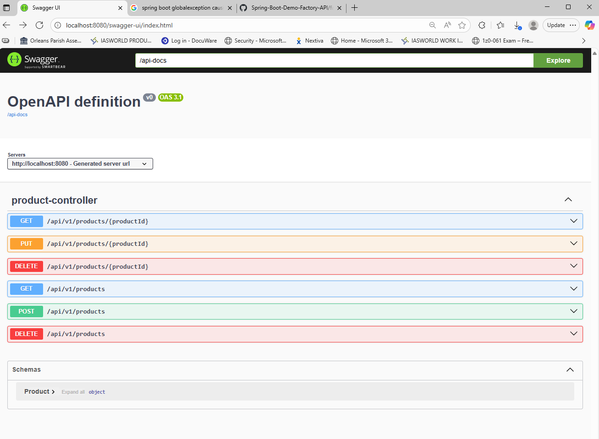
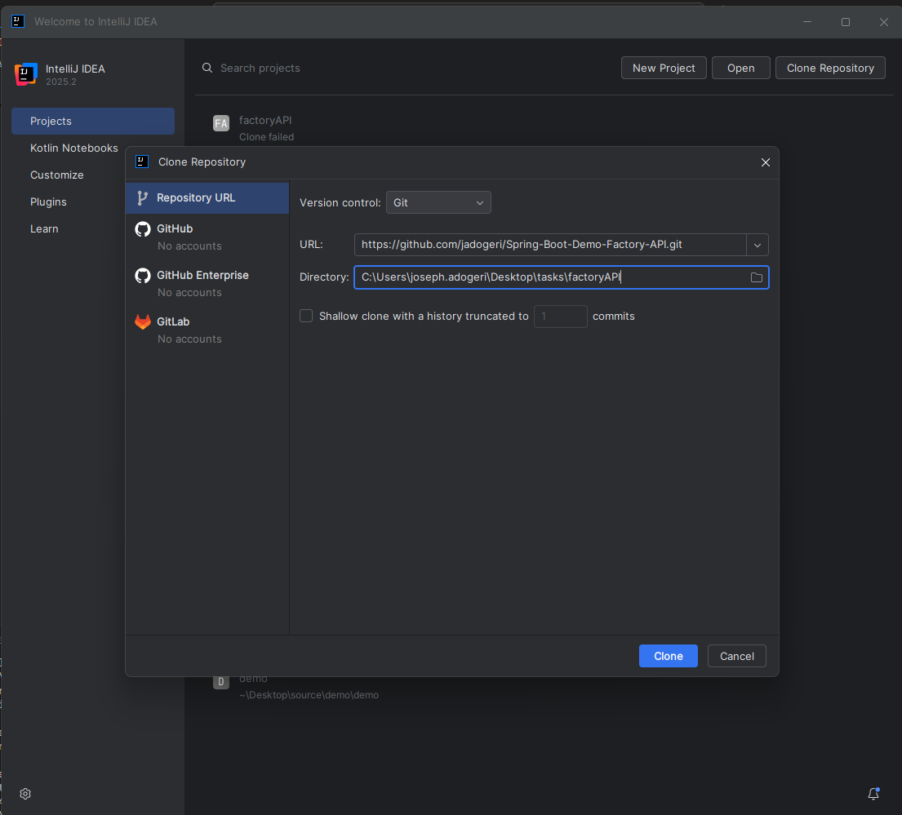
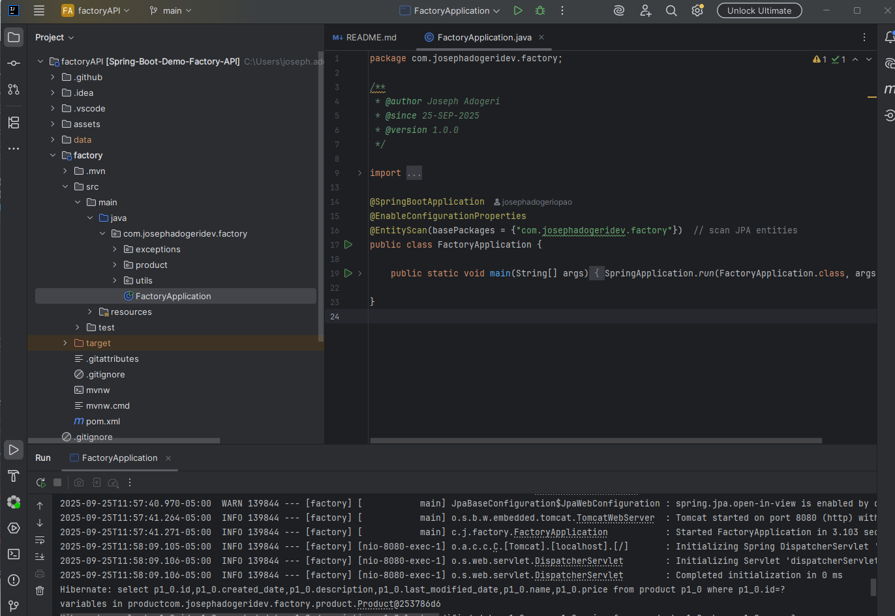
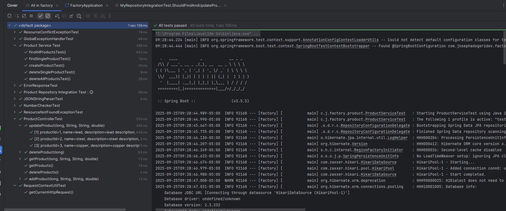
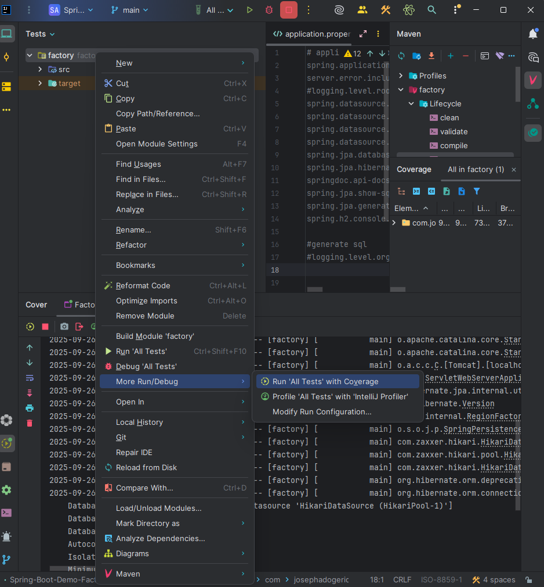
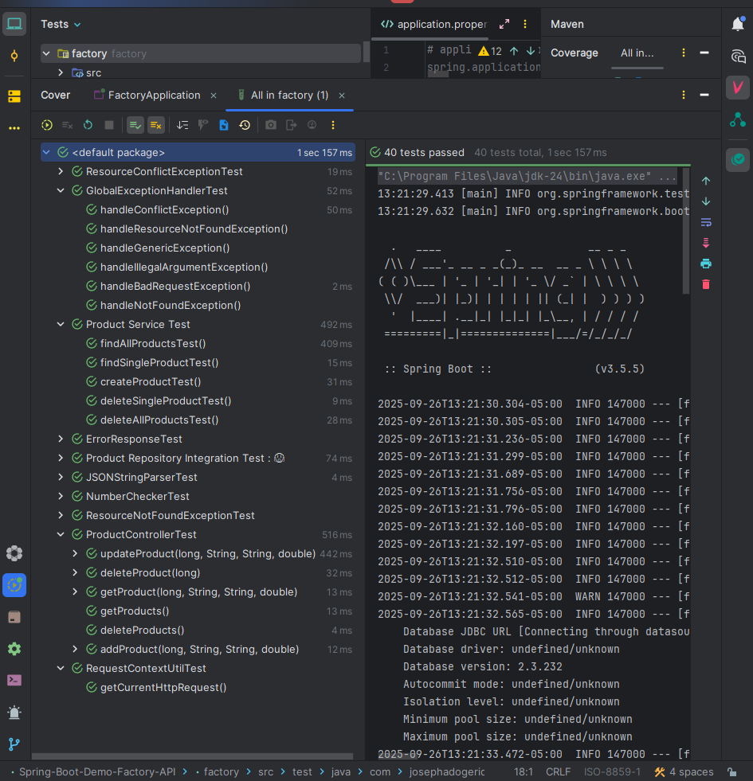

# **System Design Document (SDD)**

## **Spring Boot Demo Factory API**

**Version:** 1.0.0

**Date:** September 25, 2025

---

## Description

This is a template for Backend Application (Spring Boot) which stores Products.

## Authors

[@jadogeri](https://www.github.com/jadogeri)

## Repository

[https://github.com/jadogeri/Spring-Boot-Demo-Factory-API.git](https://github.com/jadogeri/Spring-Boot-Demo-Factory-API)


## Screenshots

|  |  |
| -------------------------------------------- | -------------------------------------------- |
|  |  |

## Table of Contents

<ul>
    <li><a href="#1-introduction">1. Introduction</a>
        <ul>
            <li><a href="#11-purpose">1.1 Purpose</a> </li>
            <li><a href="#12-scope">1.2 Scope</a> </li>
            <li><a href="#13-intended-audience">1.3 Intended Audience</a> </li>
        </ul>
    </li>
</ul>
    <ul>
      <li><a href="#2-technology-stack">2. Technology Stack</a>
      </li>
    </ul>
    <ul>
      <li><a href="#3-data-design">3. Data Design</a>
        <ul>
          <li><a href="#31-data-entities-and-relationships">3.1 Entities and Relationships</a> </li>
        </ul>
      </li>
    </ul> 
    <ul>
      <li><a href="#4-installation">4. Installation</a>
      </li>
    </ul> 
    <ul>
        <li><a href="#5-usage">5. Usage</a>
        <ul>
            <li><a href="#51-run-application">5.1 Run Application</a> </li>
        </ul>
        </li>
    </ul> 
    <ul>
        <li><a href="#6-api-testing">6. API Testing</a>
        </li>
    </ul> 
    <ul>
        <li><a href="#7-tests">7. Tests</a>
        </li>
    </ul>  
    <ul>  
        <li><a href="#8-license">8. License</a>
        </li>
    </ul> 
    <ul> 
        <li><a href="#9-references">9. References</a>
        </li>
    <ul>

## **1. Introduction**

### **1.1 Purpose**

This document outlines the system architecture, components, and design considerations for Factory API. The goal is to provide a template for backend developers to handle CRUD operations.

### **1.2 Scope**

The system will allow users to:

- Create Products.
- Interact with API via swagger.

### **1.3 Intended Audience**

- Junior or Senior backend developers.
- beginners learning Spring Boot (Java).

---

## **2. Technology Stack**

- **Programming Languages**: Java, SQL
- **IDE**: IntelliJ and Visual Studio Code (VSCode)
- **Backend Frameworks**: Spring Boot JPA
- **Database**: H2 Database
- **Test**: JUnit and TestContainers
- **Plugins**: Early AI
- **Container**: Docker
- **Version Control**: Git and GitHub
- **CI/CD**: GitHub Actions
- **Code Analsis**: SonarQube
- **Documentation**: Swagger


## **3. Data Design**

### **3.1 Data Entities and Relationships**

| Entity | Description                                          |
| ------ | ---------------------------------------------------- |
| PRODUCT   | product made in factory. |


---

## **4. Installation**

* [Download and install IntelliJ Community Edition](https://www.jetbrains.com/idea/download/?section=windows)
* [Download and install Java](https://www.oracle.com/java/technologies/downloads/)
* [Download and install Maven](https://maven.apache.org/download.cgi)
* [Download and install Docker - Windows](https://docs.docker.com/desktop/setup/install/windows-install/)
* [Download and install Docker - Mac](https://docs.docker.com/desktop/setup/install/mac-install/)

---

## **5. Usage**

**Prerequisites** :installation of Java, Docker and Maven.

### **5.1 Run Application**

0 open intelliJ IDE.

1 Select option `CLONE REPOSITORY` .

2 Copy and paste url `https://github.com/jadogeri/Spring-Boot-Demo-Factory-API.git` and choose location to save project then press clone.

 (Note!! choose empty folder : I created folder factoryAPI)




3 Change view to Project.

4 Navigate to factory --> `src` --> `main` -- `java`.

5 Inspect file `FactoryApplication.java`.

6 Press play button to start application.




## **6. API Testing**

**Prerequisites** : Ensure container or local application is running.

**Note** : Use [http://localhost:8080/swagger-ui/index.html](http://localhost:8080/swagger-ui/index.html) docs for testing endpoints.


---

## **7. Tests**
Tests can be ran by the following means below.
<ol>
  <li>Terminal</li>
  <li>IntelliJ IDE </li>
</ol>

***1. Terminal***


1. In the root of (factory directory), run command mvn test.

```bash
  mvn test
```



---

***2. IntelliJ IDE***


1 Change folder structure to Tests.
2 Right click on project folder (factory) --> `Navigate to More Run/Debug` --> `Run all Tests with Coverage`.

|  |  |
| -------------------------------------------- | -------------------------------------------- |
|                                              |                                              |
## **8. License**

[LICENSE](/LICENSE)

---

## **9. References**

* JUnit5 : [JUnit 5 User Guide](https://docs.junit.org/current/user-guide/).
* Symflower : [Symflower feature overview](https://www.youtube.com/watch?v=17KKqlLNcTc).
* TestContainers : [Awesome Readme Templates](https://awesomeopensource.com/project/elangosundar/awesome-README-templates)
* Swagger :  [Swagger API Documentation for Spring Boot 3](https://www.baeldung.com/spring-rest-openapi-documentation)
* Medium : [Handling exceptions and error responses ](https://leejjon.medium.com/handling-exceptions-and-error-responses-in-java-rest-services-afda273c9d2f)
* TutorialsPoint : [JUnit unit testing tool](https://www.tutorialspoint.com/junit/junit_basic_usage.htm)
